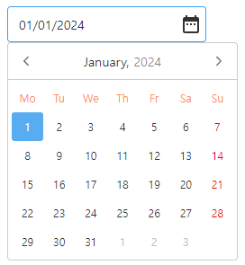

# Snow DatePicker

<div align="center">
    
</div>

Pure (vanilla) javascript datepicker

## Install

```bash
npm i snow-datepicker
```

## Usage

```javascript
import SnowDatePicker from 'snow-datepicker';
import 'snow-datepicker/snow-datepicker.css';

new SnowDatePicker('#element'[, options]);
```

### Without package manager

```html
<script src="https://cdn.jsdelivr.net/npm/snow-datepicker/snow-datepicker.min.js"></script>
<script>
  new SnowDatePicker('#element'[, options]);
</script>
```

## Documentation

- [Snow DatePicker](https://janghye0k.github.io/snow-datepicker)

## Download

Download the latest version of Snow DatePicker at [https://www.jsdelivr.com/package/npm/snow-datepicker](https://www.jsdelivr.com/package/npm/snow-datepicker)

Check the releases and source code of Snow DatePicker at [https://github.com/janghye0k/snow-datepicker/releases](https://github.com/janghye0k/snow-datepicker/releases)

## License

Snow DatePicker is [MIT](./LICENSE) licensed
